# Vendor Performance Data Analysis

**Tech Stack:** SQL | Python | Power BI

A comprehensive analysis of vendor purchasing patterns, sales performance, inventory turnover, and profitability insights. The project follows a complete data pipeline from raw CSV ingestion to interactive dashboards, covering ETL, exploratory data analysis, statistical hypothesis testing, and business recommendations.

---

## Table of Contents

- [Project Overview](#project-overview)
- [Business Problem](#business-problem)
- [Project Architecture](#project-architecture)
- [Database Schema & SQL](#database-schema--sql)
- [Data Cleaning & Feature Engineering](#data-cleaning--feature-engineering)
- [Exploratory Data Analysis](#exploratory-data-analysis)
- [Analysis & Findings (Q1 - Q9)](#analysis--findings-q1---q9)
- [Statistical Testing](#statistical-testing)
- [Power BI Dashboard](#power-bi-dashboard)
- [Automation Pipeline](#automation-pipeline)
- [Key Insights Summary](#key-insights-summary)
- [Recommendations](#recommendations)
- [Project Structure](#project-structure)
- [How to Run](#how-to-run)

---

## Project Overview

This project analyzes vendor performance data to uncover actionable insights for improving procurement strategy, inventory management, and profitability. It ingests raw transaction data from CSV files into a MySQL database, creates a unified summary table via optimized SQL queries, performs statistical analysis and visualization in Python, and presents the results through an interactive Power BI dashboard.

**Key objectives:**
- Identify underperforming brands needing promotional or pricing adjustments
- Determine top vendors contributing to sales and gross profit
- Analyze the impact of bulk purchasing on unit costs
- Assess inventory turnover to reduce holding costs
- Investigate the profitability variance between high and low performing vendors

---

## Business Problem

Effective inventory and sales management are critical for optimizing profitability in the retail and wholesale industry. Companies face several challenges:

- Inefficient pricing leading to missed revenue opportunities
- Poor inventory turnover tying up working capital
- Over-dependence on a small set of vendors creating supply risk
- Lack of visibility into which products and vendors drive true profitability

This analysis tackles these challenges head-on with data-driven insights.

---

## Project Architecture

### Technology Stack

| Component | Technology |
|-----------|-----------|
| Database | MySQL (localhost:3306) |
| Data Processing | Python (Pandas, NumPy) |
| Statistical Analysis | SciPy (t-tests, confidence intervals) |
| Visualizations | Matplotlib, Seaborn |
| Dashboard | Power BI |
| Logging | Python logging module |

### Data Flow

```
Raw CSV Files  -->  MySQL Tables  -->  ETL Pipeline  -->  vendor_sales_summary
                                                           |
                                                           v
                                              Python Analysis + Visualizations
                                                           |
                                                           v
                                                  Power BI Dashboard
```

### Source Data

Six CSV files form the raw data foundation:

| File | Description |
|------|-------------|
| `begin_inventory.csv` | Opening inventory levels |
| `end_inventory.csv` | Closing inventory levels |
| `purchases.csv` | Purchase transactions (vendor, brand, quantity, dollars) |
| `purchase_prices.csv` | Product-wise actual and purchase prices |
| `sales.csv` | Sales transactions (brand, quantity, revenue, excise tax) |
| `vendor_invoice.csv` | Aggregated purchase data with freight costs |

---

## Database Schema & SQL

### Core Table: `vendor_sales_summary`

The central analytical table is built by joining four source tables using a CTE-based SQL query:

```sql
WITH FreightSummary AS (
    SELECT VendorNumber, ROUND(SUM(Freight), 2) AS FreightCost
    FROM vendor_invoice
    GROUP BY VendorNumber
),
AggregatedPurchases AS (
    SELECT VendorNumber, VendorName, Brand, PurchasePrice,
           SUM(Quantity) AS TotalPurchasedQuantity,
           ROUND(SUM(Dollars), 2) AS TotalPurchasedDollars
    FROM purchases
    WHERE PurchasePrice > 0
    GROUP BY VendorNumber, VendorName, Brand, PurchasePrice
),
PurchaseSummary AS (
    SELECT ap.*, pp.Volume, pp.Price AS Actual_Price
    FROM AggregatedPurchases ap
    LEFT JOIN purchase_prices pp ON ap.Brand = pp.Brand
),
SalesSummary AS (
    SELECT VendorNo, Brand,
           SUM(SalesQuantity) AS TotalSalesQuantity,
           ROUND(SUM(SalesDollars), 2) AS TotalSalesDollars,
           ROUND(SUM(SalesPrice), 2) AS TotalSalesPrice,
           ROUND(SUM(ExciseTax), 2) AS TotalExciseTax
    FROM sales
    GROUP BY VendorNo, Brand
)
SELECT ps.*, ss.*, fs.FreightCost
FROM PurchaseSummary ps
LEFT JOIN SalesSummary ss ON ps.VendorNumber = ss.VendorNo AND ps.Brand = ss.Brand
LEFT JOIN FreightSummary fs ON ps.VendorNumber = fs.VendorNumber
ORDER BY ps.TotalPurchasedDollars DESC;
```

### SQL Structure (4 CTEs)

| CTE | Purpose |
|-----|---------|
| `FreightSummary` | Aggregates freight costs per vendor |
| `AggregatedPurchases` | Pre-aggregates purchases to avoid data explosion |
| `PurchaseSummary` | Joins purchases with pricing data |
| `SalesSummary` | Aggregates sales per vendor and brand |

---

## Data Cleaning & Feature Engineering

### Inconsistencies Resolved

- **VendorName:** Inconsistent spacing -> resolved via `str.strip()`
- **Volume column:** Stored as string -> converted to `float64`
- **Null values:** 178 nulls in sales columns (TotalSalesQuantity, TotalSalesDollars, etc.) -> filled with 0
- **FreightCost nulls:** Filled with 0
- **Volume nulls:** Filled with 1 (default)

### Filtering

Records with `GrossProfit <= 0`, `ProfitMargin <= 0`, or `TotalSalesQuantity <= 0` were excluded to focus on meaningful, profitable transactions.

### Derived Columns

| Column | Formula |
|--------|---------|
| `GrossProfit` | TotalSalesDollars - TotalPurchasedDollars |
| `ProfitMargin` | GrossProfit / TotalSalesDollars |
| `StockTurnOver` | TotalSalesQuantity / TotalPurchasedQuantity |
| `SalesToPurchaseRatio` | TotalSalesQuantity / TotalPurchasedQuantity |

---

## Exploratory Data Analysis

### Numerical Distributions (Before Filtering)

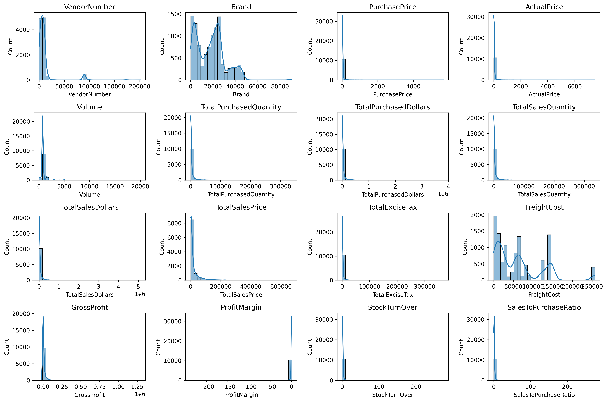
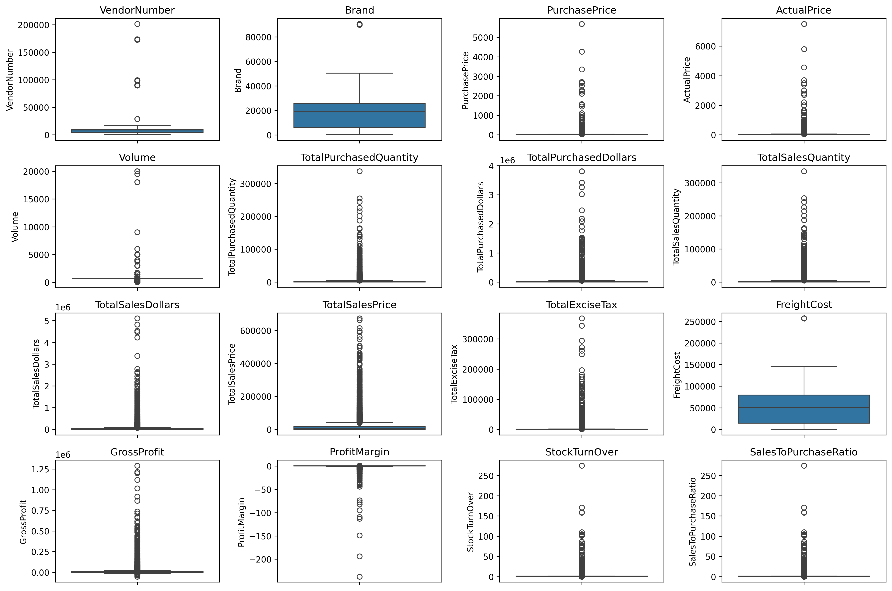

### Numerical Distributions (After Filtering)

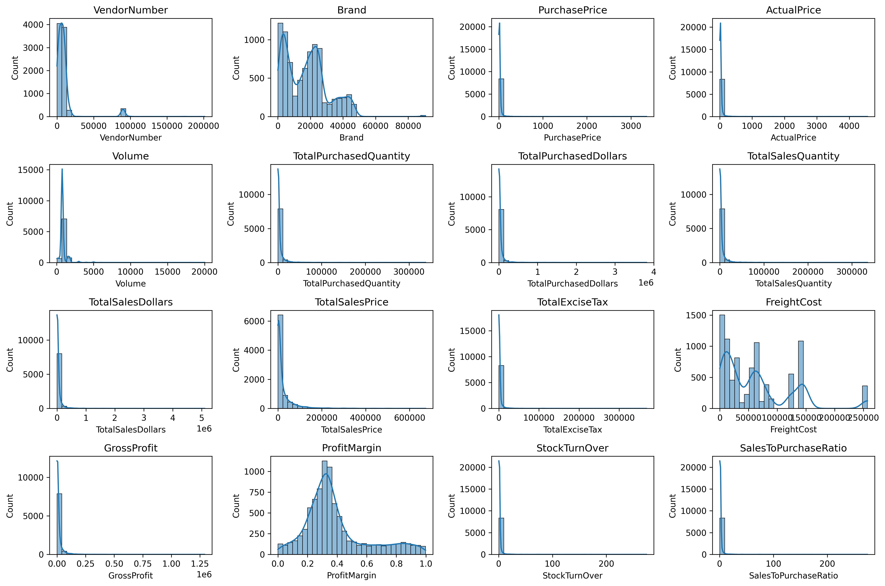
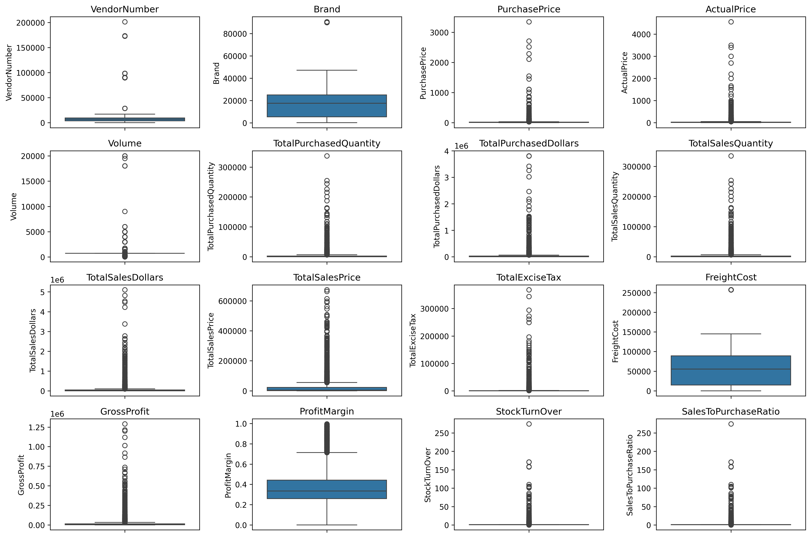

### Categorical Distribution

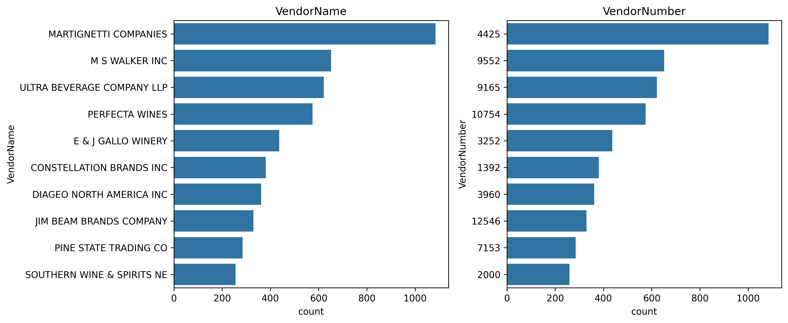

### Correlation Heatmap

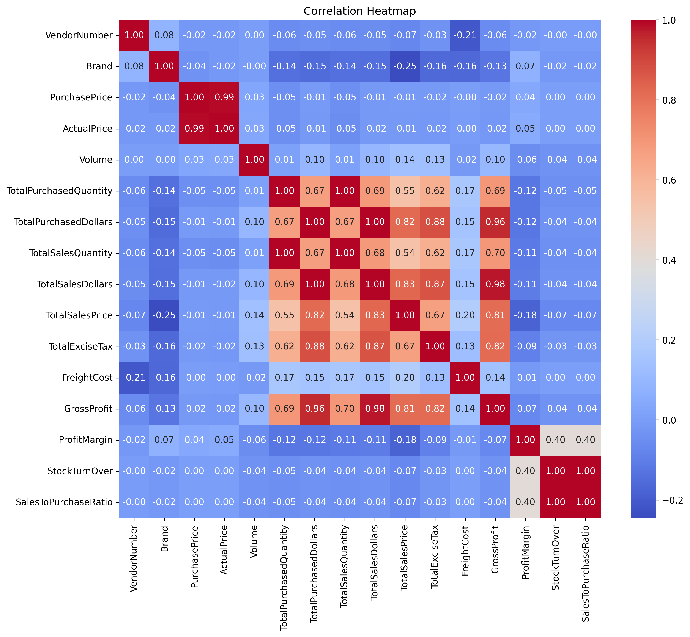

### Key Correlation Insights

- Purchase price has weak correlation with TotalSalesDollars (-0.012) and GrossProfit (-0.016) - price variations don't significantly impact revenue
- Strong correlation between purchase qty and sales qty (0.999) confirms efficient inventory turnover
- Negative correlation between ProfitMargin and TotalSalesPrice (-0.179) suggests competitive pricing pressure
- StockTurnOver has weak negative correlation with both GrossProfit (-0.038) and ProfitMargin (-0.555) - faster turnover doesn't guarantee higher profitability

---

## Analysis & Findings (Q1 - Q9)

### Q1. Brands needing promotional or pricing adjustments

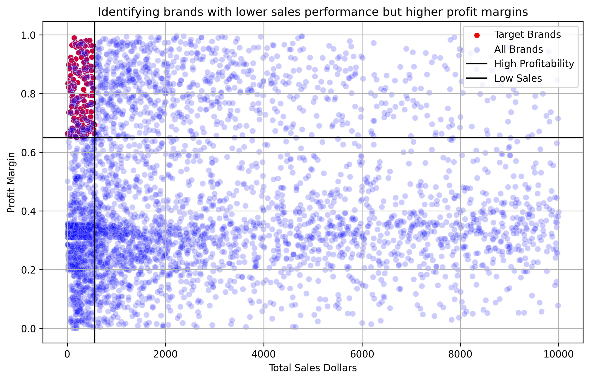

**Method:** Grouped by brand, computed sum of TotalSalesDollars and mean of ProfitMargin. Brands below the 15th percentile in sales and above the 85th percentile in profit margin were flagged.

**Finding:** These brands don't sell much volume, but when they do, the profit margins are solid - typically premium-ish products flying under the radar. A small promotional push or pricing tweak could unlock their volume without eating into margin.

---

### Q2. Top vendors and brands by sales performance

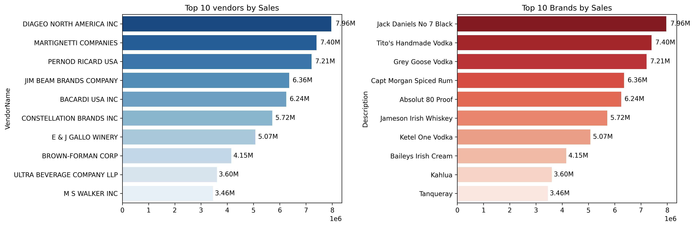

**Method:** Grouped by VendorName and Description, summed TotalSalesDollars, selected top 10.

**Finding:** These are the heavy lifters bringing in the most revenue. Strengthen relationships and negotiate better terms starting with these vendors.

---

### Q3. Vendors contributing most to total purchase dollar

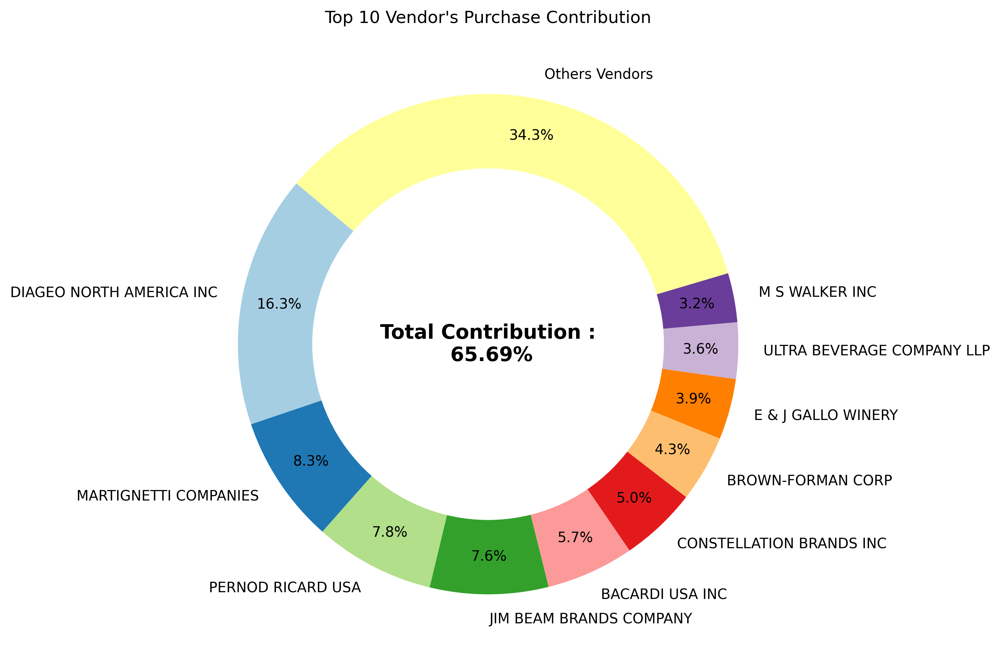

**Method:** Grouped by VendorName, calculated PurchaseContribution% as (TotalPurchasedDollars / total of all purchased dollars) x 100.

**Finding:** Just 10 out of 119 vendors account for roughly **65%** of all purchase dollars spent. The remaining 109 vendors split the other 35%. Classic concentration pattern.

---

### Q4. Procurement dependency on top vendors

**Method:** Cumulative purchase contribution of top 10 vendors from Q3.

**Finding:** Roughly **65% of total sourcing** depends on the top 10 vendors. This is a double-edged sword - great for relationship leverage, risky if any single vendor goes south. Diversification is worth monitoring.

---

### Q5. Does bulk purchasing reduce unit price?

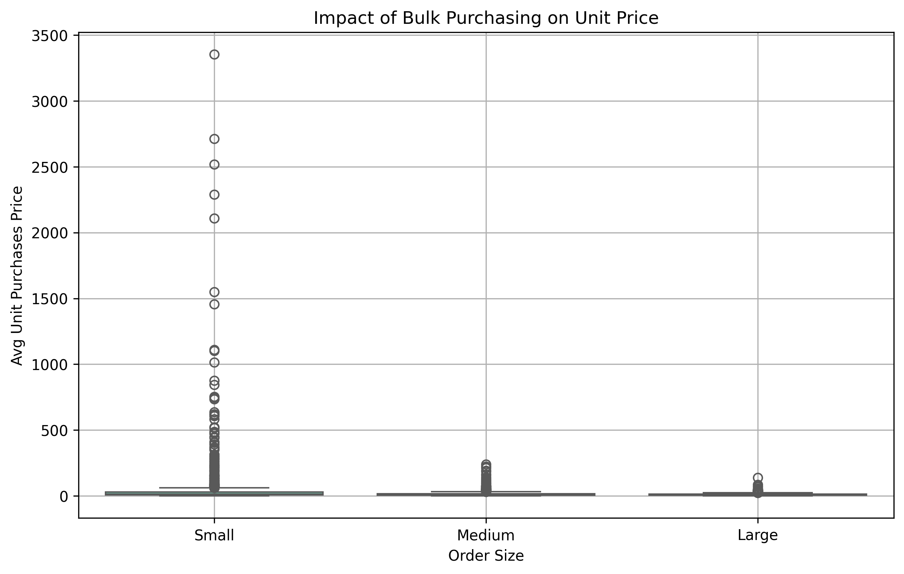

**Method:** Calculated UnitPurchasesPrice = TotalPurchasedDollars / TotalPurchasedQuantity. Created OrderSize categories (Small, Medium, Large) using qcut.

**Finding:** Yes, bulk purchasing significantly reduces unit price. Large orders average approximately **$10.78 per unit** vs. small orders - roughly **72% reduction** in unit cost. The Large order tier is the sweet spot.

---

### Q6. Vendors with low inventory turnover

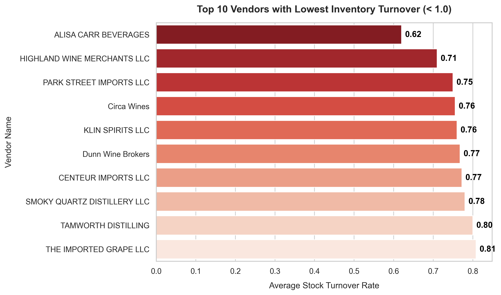

**Method:** Filtered vendors with StockTurnOver < 1.0, grouped by VendorName, sorted ascending.

**Finding:** These vendors have stock turnover below 1.0 - their inventory moves slower than one complete cycle per period. Products are collecting dust, tying up shelf space and capital.

---

### Q7. Capital locked in unsold inventory

**Method:** UnsoldInventoryValue = (TotalPurchasedQuantity - TotalSalesQuantity) x UnitPurchasesPrice. Grouped by VendorName and sorted descending.

**Finding:** The analysis ranks top 10 vendors by capital tied up in non-moving stock. These vendors are hurting cash flow the most - money spent on inventory that has not yielded returns.

---

### Q8. 95% Confidence Interval for profit margins

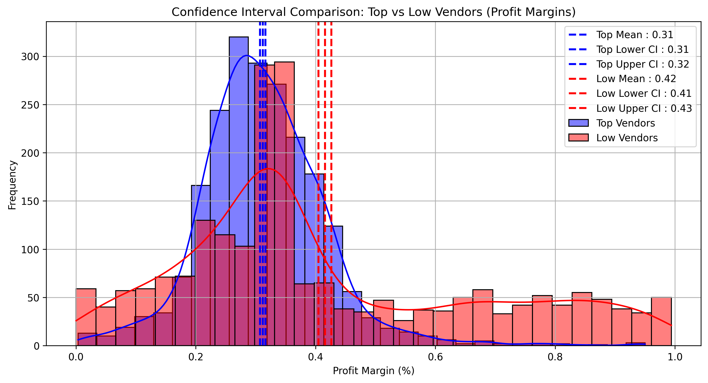

**Method:** Top performers defined as vendors above the 75th percentile of TotalSalesDollars; low performers below the 25th percentile. CI calculated using t-distribution at 95% confidence.

| Group | Confidence Interval | Mean |
|-------|-------------------|------|
| Top-performing vendors | 0.31 to 0.32 | ~0.315 |
| Low-performing vendors | 0.41 to 0.43 | ~0.42 |

**Finding:** Low-sales vendors surprisingly have **higher** profit margins - they sell less but keep more per sale, likely from premium pricing or leaner operations.

---

### Q9. Significant difference in profit margins?

**Method:** Two-sample Welch's t-test comparing profit margins of top-performing vs low-performing vendors.

**Result:** The **p-value is below 0.05**, confirming a statistically significant difference. Low-performing vendors have meaningfully higher profit margins than top performers.

**Key insight:** High volume does not equal high margin. Top vendors sell a ton at thinner margins; low vendors sell less but keep a bigger slice.

---

## Statistical Testing

### Hypothesis Test Summary

| Component | Detail |
|-----------|--------|
| Null Hypothesis (H0) | No significant difference in profit margin between groups |
| Alternate Hypothesis (H1) | Significant difference exists |
| Test Used | Welch's t-test (unequal variance) |
| Significance Level | alpha = 0.05 |
| Result | Reject H0 - significant difference confirmed |

### Business Interpretation

- **Top vendors** (high sales volume) operate on thinner margins - competing on price and volume
- **Low vendors** (low sales volume) enjoy higher margins - premium pricing or niche products
- Top vendors should explore selective price adjustments and cost optimization
- Low vendors need better marketing and distribution to convert high margins into high absolute profit

---

## Power BI Dashboard

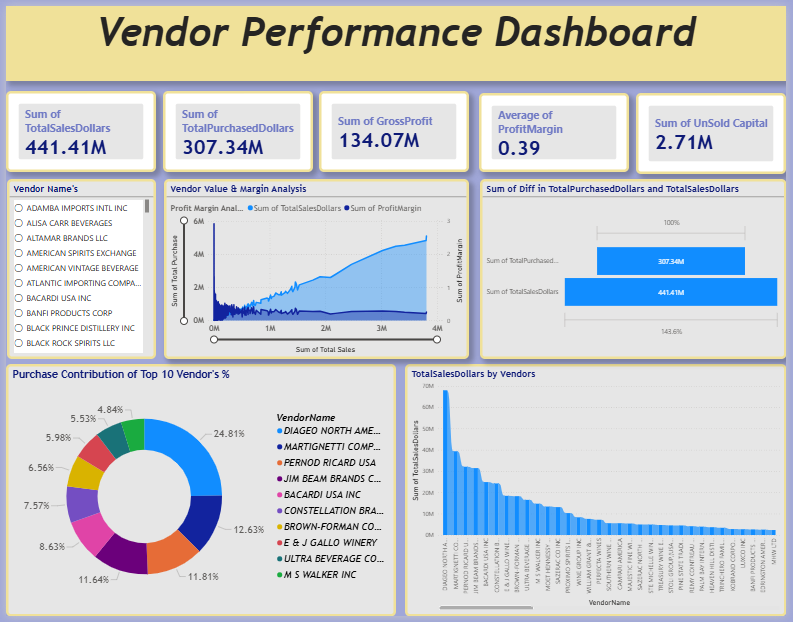

An interactive Power BI dashboard was built to visualize key metrics:
- Overall purchase and sales performance
- Top vendors by purchase contribution and sales
- Inventory turnover analysis
- Profit margin distribution
- Confidence interval comparisons

---

## Automation Pipeline

### Script: `scripts/vendor_pipeline.py`

An automated ETL pipeline that:
1. Connects to MySQL database
2. Runs the vendor_sales_summary CTE query
3. Cleans data (strips whitespace, fills nulls, converts types)
4. Creates derived columns (GrossProfit, ProfitMargin, StockTurnOver)
5. Saves the result back to the database
6. Logs all activities to `logs/vendor_pipeline.log`

Designed for scheduled execution (cron / Task Scheduler) for continuous data ingestion.

### Script: `scripts/data_send_to_db.py`

Reads all 6 CSV files from the `data/` directory and pushes them into MySQL tables with logging.

---

## Key Insights Summary

| # | Insight |
|---|---------|
| 1 | Top 10 vendors account for ~65% of total procurement spend - high concentration risk |
| 2 | Bulk purchasing yields ~72% reduction in unit cost - incentivize larger orders |
| 3 | Low inventory turnover vendors need attention to free up working capital |
| 4 | Profit margins are inversely related to sales volume - not all growth is profitable |
| 5 | Statistically significant margin gap exists between top and low performers |

---

## Recommendations

### For Underperforming Brands (High Margin, Low Sales)
- Run targeted promotions and feature placements to boost volume
- Bundle with high-volume products to increase visibility
- Review pricing strategy - room to adjust without destroying margin

### For Top Vendors (High Sales, Lower Margin)
- Explore selective price increases on less price-sensitive products
- Optimize operational costs to protect profitability
- Negotiate better purchase terms given high volume commitment

### For Inventory Management
- Review bottom 10 vendors by inventory turnover - consider markdowns or returns
- Implement just-in-time ordering for slow-moving categories
- Free up capital locked in unsold inventory

### For Procurement Strategy
- Reduce dependency on top 3-5 vendors - diversify sourcing
- Incentivize bulk orders with tiered pricing discounts
- Regularly monitor purchase contribution concentration

---

## Project Structure

```
vendor-performance-data-analysis-SQL-Python-PowerBI/
|
|-- data/                      # Raw CSV files (gitignored)
|-- images/                    # All visualizations (PNG)
|   |-- numerical_distributions.png
|   |-- numerical_boxplots.png
|   |-- correlation_heatmap.png
|   |-- categorical_countplots.png
|   |-- top_10_vendors_and_brands_by_sales.png
|   |-- vendor_contribution_to_total_purchase.png
|   |-- brands_with_lower_sales_performance_but_higher_profit_margins.png
|   |-- unit_purchases_price_by_order_size.png
|   |-- vendors_lowest_inventory_turnover.png
|   |-- confidence_interval_comparison.png
|   |-- vendor-performance-dashboard.png
|
|-- logs/                      # Pipeline logs
|-- scripts/
|   |-- data_send_to_db.py     # CSV to MySQL ingestion
|   |-- vendor_pipeline.py     # Automated ETL pipeline
|
|-- vendor_performance_analysis.py   # Full analysis (Q1-Q9)
|-- eda.py                     # Exploratory data analysis
|-- sql_queries.sql            # SQL query development history
|-- questions.txt              # Questions with answers
|-- insights.txt               # Key findings and interpretations
|-- Business Problem.txt       # Business context
|-- imp_notes.txt              # Development notes
|-- .gitignore
|-- README.md
```

---

## How to Run

### Prerequisites

- Python 3.8+
- MySQL server running on localhost:3306
- Required Python packages: `pandas`, `numpy`, `matplotlib`, `seaborn`, `pymysql`, `sqlalchemy`, `scipy`

### Steps

1. **Import CSV data into MySQL:**
   ```bash
   python scripts/data_send_to_db.py
   ```

2. **Run the ETL pipeline:**
   ```bash
   python scripts/vendor_pipeline.py
   ```

3. **Run the full analysis:**
   ```bash
   python vendor_performance_analysis.py
   ```

4. **Open the Power BI dashboard:**
   Load the `.pbix` file (if available) in Power BI Desktop.

> **Note:** The `data/` folder is gitignored. Ensure CSV files are placed there before running the ingestion script.

---

*Generated for the Vendor Performance Data Analysis project.*
